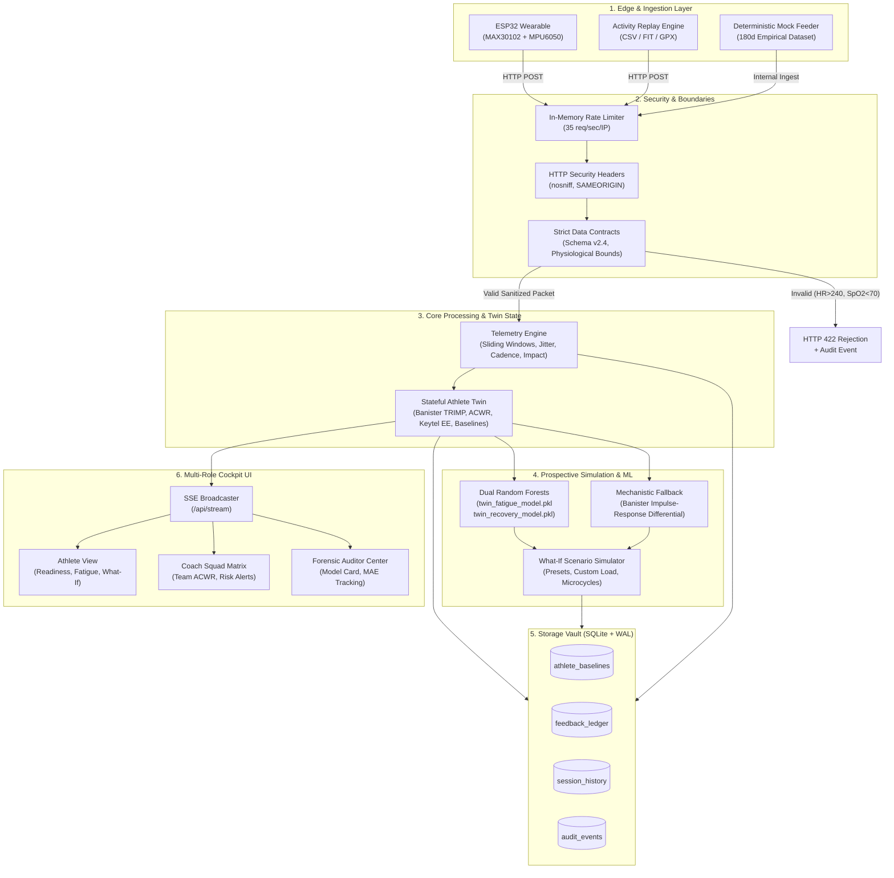

# System Design Document (ARCHITECTURE)
## Twin-Athlete: Production Architecture & Systems Blueprint
**Document Version:** `2.5.0`  
**Status:** Approved Architectural Specification  

---

### 1. High-Level Architecture Overview

Twin-Athlete implements a reactive, closed-loop telemetry and simulation pipeline. Sensor data flows through strict boundary validation, real-time kinematics extraction, stateful digital twin kinetics, dual-mode predictive simulation, and embedded local persistence before streaming to a multi-role web cockpit.



---

### 2. Recommended Scalable File Hierarchy

This modular structure establishes a clean separation of concerns, decouples domain logic from web frameworks, and provides designated locations for planned capabilities:

```text
twin-athlete/
├── .github/
│   └── workflows/
│       ├── test-suite.yml              # Automated unittest pipeline
│       └── model-audit.yml             # Automated model card verification
├── docs/                               # Canonical documentation
│   ├── README.md                       # Documentation index
│   ├── PRD.md                          # Product Requirements Document
│   ├── ARCHITECTURE.md                 # System Design Document (This File)
│   ├── TECH_STACK.md                   # Tech Stack & Architectural Rationale
│   └── SCIENTIFIC_FOUNDATIONS.md       # Mathematical & physiological reference
├── firmware/                           # Edge hardware implementation
│   ├── esp32_firmware/
│   │   └── esp32_firmware.ino          # FreeRTOS dual-core I2C sensor sampling
│   └── hardware_wiring_schematic.png   # MAX30102 + MPU6050 wiring diagram
├── models/                             # Versioned model artifacts & card
│   ├── twin_fatigue_model.pkl          # Trained Random Forest fatigue model
│   ├── twin_recovery_model.pkl         # Trained Random Forest recovery model
│   ├── twin_features.json              # Canonical feature vector contract
│   └── model_card.json                 # Model Card v2.4 metadata & metrics
├── static/                             # Zero-build vanilla web cockpit
│   ├── css/
│   │   └── style.css                   # Glassmorphic CSS design system
│   ├── js/
│   │   ├── app.js                      # Cockpit controller & SSE listeners
│   │   └── charts.js                   # Lightweight SVG / Canvas real-time charts
│   ├── images/
│   │   └── digital_twin_logo.png       # Brand assets
│   └── index.html                      # Semantic HTML5 cockpit template
├── app.py                              # Application entry point & hardened Flask server
├── twin/                               # Core application package
│   ├── __init__.py                     # Package initialization
│   ├── contracts.py                    # Data contracts & validation schemas
│   ├── coach.py                        # Athlete baseline, TRIMP, ACWR kinetics & prediction tracker
│   ├── telemetry.py                    # Signal quality, sliding-window filters & vitals
│   ├── simulator.py                    # Forward step & counterfactual simulation engine
│   ├── registry.py                     # Multi-athlete squad registry
│   ├── bridge.py                       # UART serial-to-HTTP ESP32 bridge
│   └── storage.py                      # Zero-dependency SQLite WAL persistence vault
├── ml/                                 # Training, evaluation & synthetic data
│   ├── train.py                        # Model training pipeline & model card exporter
│   ├── generate_data.py                # Parametric longitudinal dataset generator
│   ├── model_card.json                 # Verifiable model card evaluation artifact
│   ├── models/                         # Serialized Random Forest models & feature metadata
│   │   ├── twin_fatigue_model.pkl
│   │   ├── twin_recovery_model.pkl
│   │   └── twin_features.json
│   └── data/
│       └── synthetic_athlete_dataset.csv
├── tests/                              # 47-Test Forensic Verification Suite
│   ├── __init__.py
│   ├── test_ai_coach.py                # TRIMP, ACWR, readiness scoring tests
│   ├── test_telemetry.py               # Sliding window, cadence, impact g tests
│   ├── test_simulator.py               # Dual-path (ML + Mechanistic fallback) tests
│   ├── test_registry.py                # Multi-athlete registry and squad state tests
│   ├── test_storage.py                 # SQLite WAL persistence & ledger tests
│   ├── test_e2e_api.py                 # Flask REST endpoints & SSE streaming tests
│   └── test_forensics_e2e.py           # Contract validation, security & feedback tests
├── scripts/                            # Operational utility scripts
│   └── verify_live_system.py           # Live server & hardware verification script
├── static/                             # Web presentation cockpit
│   ├── index.html                      # Semantic HTML5 cockpit template
│   ├── app.js                          # Reactive frontend controller
│   ├── style.css                       # Modern CSS design system
│   └── images/                         # Graphic assets
├── firmware/                           # Hardware edge firmware
│   ├── WIRING_GUIDE.md                 # Hardware wiring & setup guide
│   └── esp32_athlete_tracker/          # Production Arduino C++ firmware
├── docs/                               # Architecture and scientific documentation
├── Dockerfile                          # Multi-stage python:3.11-slim container
├── Procfile                            # Gunicorn production worker configuration
├── requirements.txt                    # Pinned production dependencies
└── README.md
```

---

### 3. Detailed Component Responsibilities

| Component | Primary File | Responsibilities | Key Design Patterns |
| :--- | :--- | :--- | :--- |
| **Data Contracts** | `twin/contracts.py` | Validates sensor payloads, enforces bounds, tags provenance (`LIVE`/`DEMO`), clamps noise. | Data Transfer Object (DTO), Boundary Validator |
| **Telemetry Engine** | `twin/telemetry.py` | Sliding-window buffering ($N=60$), packet jitter, drop rate, cadence zero-crossings, impact magnitude. | Sliding Window Buffer, Observer |
| **Digital Twin** | `twin/coach.py` | Computes Banister TRIMP, ACWR, Keytel EE, gait asymmetry, and manages personalized baselines. | Stateful Digital Twin, Strategy Pattern |
| **Simulator** | `twin/simulator.py` | 1-day forward transitions, What-If counterfactuals, multi-day periodization, overtraining risk. | Dual-Mode Execution (ML with Mechanistic Fallback) |
| **Storage Vault** | `twin/storage.py` | Persists baselines, feedback records, completed sessions, and audit events locally in SQLite WAL mode. | Repository Pattern, Thread-Safe Connection Pool |
| **Cockpit UI** | `static/` | Renders Athlete, Coach, and Auditor cockpits, listens to SSE stream, updates real-time SVG charts. | Zero-Build Component Architecture, Reactive Event Bus |

---

### 4. Data Flow from Sensor to Cockpit

```
[ESP32 Wearable / Replay Stream]
           │
           │ HTTP POST /api/esp32/telemetry {device_id, heart_rate, spo2, ax, ay, az, battery}
           ▼
[Security Middleware & Rate Limiting]
           │ Checks 35 req/sec limit; adds X-Content-Type-Options & SAMEORIGIN headers
           ▼
[twin/contracts.py: validate_sensor_packet()]
           │ Rejects out-of-bounds payloads (HR > 240, SpO2 < 70) with HTTP 422
           │ Clamps accelerometer readings to [-16g, +16g]; attaches arrival timestamp
           ▼
[twin/telemetry.py: process_telemetry()]
           │ Updates 60-sample rolling deques for HR, SpO2, and IMU
           │ Computes packet jitter σ(Δt) and drop-rate percentage
           │ Detects steps via ay zero-crossings; computes cadence (SPM) and peak impact (g)
           ▼
[twin/coach.py: Stateful Twin Update]
           │ Computes incremental Banister TRIMP cardiovascular dose
           │ Evaluates Acute (7d) vs Chronic (28d) ACWR workload safety bands (0.8 - 1.3)
           │ Calculates bilateral gait asymmetry percentage
           │ Calibrates readiness against personalized baseline tier (Cold-Start / Calibrated)
           ▼
[twin/simulator.py: Forward Step Simulation]
           │ Predicts next-day fatigue and recovery via Dual Random Forests (±4.3 pts)
           │ Falls back to Banister impulse-response differential kinetics if models unavailable
           ▼
[twin/storage.py: StorageVault Commit]
           │ Logs prospective prediction record (PRED-XXXX) as PENDING_VERIFICATION
           │ Updates athlete baseline parameters in SQLite
           ▼
[Server-Sent Events: /api/stream]
           │ Broadcasts unified JSON state packet to connected browser clients at 1 Hz
           ▼
[Cockpit Frontend: static/app.js]
           │ Updates live gauges (Readiness, Fatigue, Recovery, TRIMP)
           │ Appends data points to SVG/Canvas sparklines
           │ Refreshes Coach Squad Matrix ACWR screening & Auditor quality indicators
```

---

### 5. Persistence Strategy: SQLite with WAL Mode

To maintain zero cloud dependencies while guaranteeing high-speed concurrent execution, Twin-Athlete uses an embedded SQLite database in **Write-Ahead Logging (WAL)** mode.

#### Key SQLite Pragmas:
```sql
PRAGMA journal_mode = WAL;
PRAGMA synchronous = NORMAL;
PRAGMA temp_store = MEMORY;
PRAGMA cache_size = -64000; -- 64MB cache
```

#### Benefits for Telemetry Systems:
1. **Concurrency:** Writers (1 Hz telemetry ingestion) do not block readers (REST dashboard polling and SSE broad-casters).
2. **Crash Resilience:** Write-Ahead Logging commits transactions sequentially to the `.db-wal` file, preventing corruption during abrupt power-downs or process termination.
3. **Data Sovereignty:** All biometric records remain isolated on the user's host filesystem in `twin_athlete.db`.

---

### 6. Multi-Athlete Registry Architecture (Planned - Step 3)

The forthcoming `AthleteRegistry` module in `twin_athlete/engines/registry_engine.py` will scale the digital twin engine from a single athlete to multi-athlete squads:

```python
class AthleteRegistry:
    """Maintains active stateful DigitalTwin instances for squad rosters."""
    def __init__(self, vault: StorageVault):
        self.vault = vault
        self._twins: Dict[str, DigitalTwin] = {}
        self._device_map: Dict[str, str] = {} # device_id -> athlete_id

    def get_twin(self, athlete_id: str) -> DigitalTwin:
        if athlete_id not in self._twins:
            profile = self.vault.get_athlete_profile(athlete_id)
            self._twins[athlete_id] = DigitalTwin(profile)
        return self._twins[athlete_id]

    def route_telemetry(self, raw_packet: dict) -> dict:
        device_id = raw_packet.get("device_id")
        athlete_id = self._device_map.get(device_id, "ATH-0824")
        twin = self.get_twin(athlete_id)
        return twin.process_packet(raw_packet)

    def get_squad_acwr_matrix(self) -> List[dict]:
        """Calculates squad-wide workload distribution for the Coach Matrix."""
        return [twin.get_summary() for twin in self._twins.values()]
```

---

### 7. Closed-Loop Feedback Ledger

To satisfy the **honesty-first** philosophy, prospective predictions are held accountable:

1. **Prediction Phase:** Every simulation query logs a prospective prediction:
   ```json
   {
     "id": "PRED-1015",
     "target_metric": "Fatigue (%)",
     "predicted": 38.0,
     "status": "PENDING_VERIFICATION"
   }
   ```
2. **Outcome Verification Phase:** When the post-session ground truth is observed, `POST /api/feedback/record-outcome` reconciles the record:
   $$\text{Absolute Error} = |\hat{y} - y| = |38.0 - 39.5| = 1.5\text{ pts}$$
   $$\text{Percentage Error} = \left(\frac{1.5}{39.5}\right) \times 100 = 3.8\%$$
3. **Drift Monitoring:** The system tracks rolling Mean Absolute Error (MAE). If MAE exceeds 4.5 points over 10 consecutive sessions, the Auditor Center flags a *Model Calibration Warning*.

---

### 8. Hardware Integration Specifications

* **Microcontroller:** ESP32-WROOM-32 (240 MHz dual-core Xtensa LX6).
* **MAX30102 PPG Sensor:**
  - Sample Rate: 50 Hz optical register polling.
  - Heart Rate calculation: Peak-to-peak AC interval timing.
  - SpO2 calculation: Red/IR optical absorption ratio ($R = \frac{(AC/DC)_{\text{red}}}{(AC/DC)_{\text{ir}}}$).
* **MPU6050 6-DOF IMU:**
  - Dynamic Range: Configured to $\pm 16g$ and $\pm 2000^\circ/\text{s}$.
  - Cadence Extraction: Peak-valley zero-crossing detection on $a_y$ vertical axis.
  - Mechanical Load: Impact force vector magnitude integrated over session duration.
* **Transmission Modes:**
  1. *Direct WiFi:* Client sends HTTP POST packets directly to `/api/esp32/telemetry`.
  2. *Serial Bridge (`esp32_serial_bridge.py`):* Bridges USB UART at 115200 baud to the local REST endpoint with auto-reconnect.
