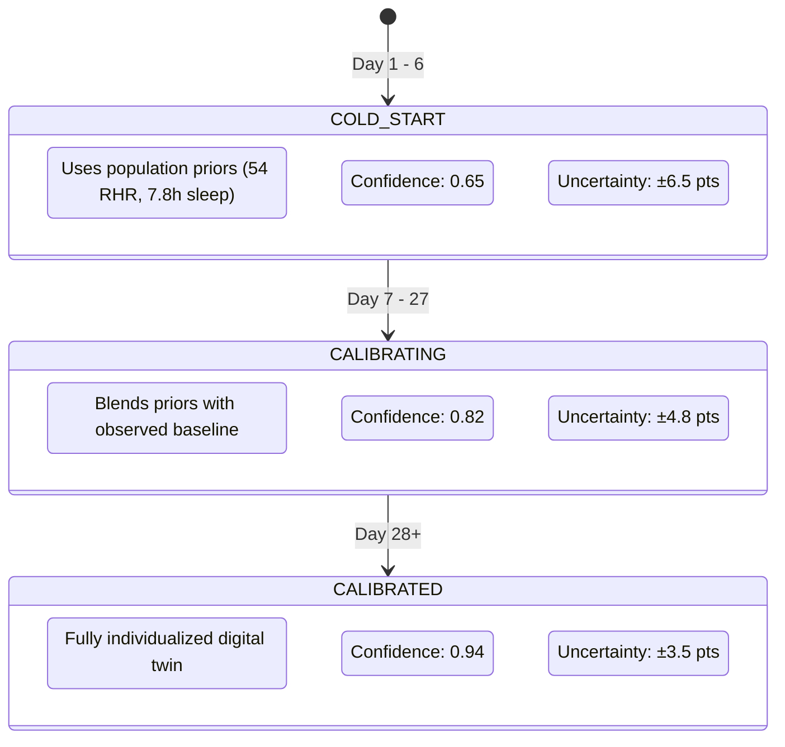

# Scientific Foundations & Mathematical Reference
## Twin-Athlete: Physiological Modeling, Algorithms & Formulation Guide
**Document Version:** `2.5.0`  
**Status:** Canonical Scientific Specification  

---

### 🛡️ Medical & Regulatory Notice
> [!IMPORTANT]
> All algorithms, physiological equations, and models documented herein are designed for **sports science training optimization and athletic decision support**. They do **NOT** constitute medical diagnostic devices, clinical decision support tools, or medical recommendations.

---

### 1. Cardiovascular Training Impulse (TRIMP)

Twin-Athlete implements both the exponential **Banister TRIMP** formulation (primary) and the categorical **Edwards TRIMP** formulation (secondary) to quantify internal cardiovascular training strain.

#### 1.1 Banister's Exponential TRIMP Formulation
* **Primary Citation:** Banister, E. W. (1991). *Modeling Elite Athletic Performance*. Human Kinetics.
* **Mathematical Definition:**
  $$\text{TRIMP} = D \times \Delta\text{HR}_{\text{ratio}} \times y$$
  where:
  - $D$ is the exercise session duration in minutes.
  - $\Delta\text{HR}_{\text{ratio}}$ is the fractional Heart Rate Reserve (HRR):
    $$\Delta\text{HR}_{\text{ratio}} = \frac{\text{HR}_{\text{avg}} - \text{HR}_{\text{rest}}}{\text{HR}_{\text{max}} - \text{HR}_{\text{rest}}}$$
  - $y$ is an exponential weighting factor reflecting non-linear blood lactate accumulation:
    $$y = 0.64 \cdot e^{1.92 \cdot \Delta\text{HR}_{\text{ratio}}} \quad (\text{Men})$$
    $$y = 0.86 \cdot e^{1.67 \cdot \Delta\text{HR}_{\text{ratio}}} \quad (\text{Women})$$
* **Physiological Meaning:** Prevents high-intensity intervals from being under-scored compared to prolonged low-intensity recovery runs by modeling exponential exponential glycolytic and cardiovascular stress.
* **Code Reference:** `ai_coach_engine.py -> calculate_training_load()`

```python
# Code Implementation (ai_coach_engine.py)
hr_ratio = (hr_avg - hr_rest) / max(1.0, (hr_max - hr_rest))
intensity_curve = 0.64 * math.exp(1.92 * hr_ratio)
trimp = duration_min * hr_ratio * intensity_curve
```

---

#### 1.2 Edwards' Categorical TRIMP Formulation
* **Primary Citation:** Edwards, S. (1993). *The Heart Rate Monitor Book*. Fleet Feet Press.
* **Mathematical Definition:** Edwards TRIMP discretizes heart rate into 5 zones based on percentages of $\text{HR}_{\text{max}}$:
  $$\text{TRIMP}_{\text{Edwards}} = \sum_{z=1}^{5} D_z \times z$$

| Zone | Label | Heart Rate Range (% HRmax) | Weight ($z$) | Target Adaptation |
| :---: | :--- | :---: | :---: | :--- |
| **Zone 1** | Active Recovery | $50\% - 60\%$ | 1 | Aerobic recovery, base vascularization |
| **Zone 2** | Aerobic Endurance | $60\% - 70\%$ | 2 | Lipid oxidation, aerobic capacity |
| **Zone 3** | Tempo / Aerobic Power | $70\% - 80\%$ | 3 | Glycogen utilization, lactate clearance |
| **Zone 4** | Lactate Threshold | $80\% - 90\%$ | 4 | High-intensity sustained power |
| **Zone 5** | Neuromuscular / VO2 Max | $90\% - 100\%$ | 5 | Peak anaerobic power, maximum cardiac output |

* **Code Reference:** `telemetry_engine.py -> get_hr_zone()`

---

### 2. Acute:Chronic Workload Ratio (ACWR)

* **Primary Citation:** Gabbett, T. J. (2016). *The training—injury prevention paradox: should athletes be training smarter and harder?* British Journal of Sports Medicine.
* **Mathematical Definition:**
  $$\text{ACWR}_t = \frac{\text{Acute Workload}_t}{\text{Chronic Workload}_t}$$
  where:
  - **Acute Workload (Fatigue Proxy):** 7-day rolling coupled workload:
    $$\text{Acute}_t = \frac{1}{7} \sum_{i=0}^{6} \text{Load}_{t-i}$$
  - **Chronic Workload (Fitness Proxy):** 28-day rolling uncoupled workload (preventing self-correlation):
    $$\text{Chronic}_t = \frac{1}{21} \sum_{i=7}^{27} \text{Load}_{t-i}$$

#### 2.1 The Gabbett Workload Safety Bands

```
ACWR Range           Risk Classification       Coaching Action
─────────────────────────────────────────────────────────────────────────────
< 0.80               UNDER-TRAINING / DETRAINING Deload recovery / rebuild fitness
0.80 - 1.30          OPTIMAL ADAPTATION          "Sweet Spot" - Peak readiness
1.35 - 1.50          FUNCTIONAL OVERREACHING     Accumulating fatigue; monitor sleep
> 1.50               DANGER ZONE                 High injury spike risk; deload immediately
─────────────────────────────────────────────────────────────────────────────
```

* **Code Reference:** `ai_coach_engine.py -> detect_anomalies()`

---

### 3. Keytel Caloric Energy Expenditure (EE)

* **Primary Citation:** Keytel, L. R., et al. (2005). *Prediction of energy expenditure from heart rate monitoring by nonlinear regression analysis*. Journal of Sports Sciences.
* **Mathematical Formulation (Male Athletes):**
  $$\text{EE} = \left[ \frac{-55.0969 + (0.6309 \times \text{HR}) + (0.1988 \times W) + (0.2017 \times A)}{4.184} \right] \times D$$
* **Mathematical Formulation (Female Athletes):**
  $$\text{EE} = \left[ \frac{-20.4022 + (0.4472 \times \text{HR}) - (0.1263 \times W) + (0.0740 \times A)}{4.184} \right] \times D$$
  where:
  - $\text{HR}$ is heart rate in beats per minute (BPM).
  - $W$ is athlete weight in kilograms (kg).
  - $A$ is athlete age in years.
  - $D$ is duration in minutes.
  - $4.184$ converts kilojoules to kilocalories (kcal).
* **Code Reference:** `telemetry_engine.py -> calculate_calories_burned()`

---

### 4. Banister 2-Component Impulse-Response Model

Twin-Athlete uses the **Banister 2-Component Differential Model** as its underlying mathematical foundation for fatigue kinetics and as its guaranteed **mechanistic fallback** when machine learning tree models are unavailable.

* **Primary Citation:** Morton, R. H., Fitz-Clarke, J. R., & Banister, E. W. (1990). *Modeling human performance in running*. Journal of Applied Physiology.
* **Differential State Equations:**
  $$P(t) = P_0 + k_1 \cdot f(t) - k_2 \cdot g(t)$$
  where:
  - $P(t)$ is predicted athletic performance readiness at time $t$.
  - $P_0$ is un-fatigued baseline performance.
  - $f(t)$ is the **Fitness Impulse** (slow adaptation, long decay):
    $$f(t) = \sum_{i=1}^{t} w_i \cdot e^{-(t-i)/\tau_1} \quad (\tau_1 \approx 42\text{ days})$$
  - $g(t)$ is the **Fatigue Impulse** (acute accumulation, rapid decay):
    $$g(t) = \sum_{i=1}^{t} w_i \cdot e^{-(t-i)/\tau_2} \quad (\tau_2 \approx 7\text{ days})$$
  - $k_1, k_2$ are individual scaling magnitudes ($k_2 > k_1$, modeling the acute dominance of fatigue).

#### 4.1 Digital Twin Forward Transition Implementation
In discrete daily steps ($t \rightarrow t+1$):
$$\text{Fatigue}_{t+1} = \left(\text{Fatigue}_t \cdot \frac{0.65}{\text{SleepFactor}}\right) + (\text{DailyLoad} \times 0.60)$$
$$\text{Recovery}_{t+1} = \left(\frac{\text{SleepHours}}{8.0} \times 85.0\right) - (\text{Fatigue}_t \times 0.25) + \text{ReboundBonus}$$
$$\text{RestingHR}_{t+1} = 52.0 + (100.0 - \text{Recovery}_{t+1}) \times 0.18$$
$$\text{Performance}_{t+1} = (\text{Recovery}_{t+1} \times 0.60) + ((100.0 - \text{Fatigue}_{t+1}) \times 0.40)$$
* **Code Reference:** `simulator.py -> simulate_single_step()`

---

### 5. Bilateral Gait Asymmetry via IMU Vertical Deceleration

* **Physical Basis:** When foot-strike occurs, the vertical axis accelerometer ($a_y$) on the pelvis or torso experiences peak ground reaction deceleration forces.
* **Mathematical Formulation:**
  $$\text{Asymmetry}_{\%} = \frac{|F_{\text{dominant}} - F_{\text{non-dominant}}|}{\max(F_{\text{dominant}}, F_{\text{non-dominant}})} \times 100$$
  where $F$ represents the mean ground reaction impact magnitude ($g$) over $M$ strides ($M \ge 30$):
  $$F = \frac{1}{M} \sum_{i=1}^{M} \max(a_{y, i})$$
* **Thresholds:**
  - $\text{Asymmetry} < 10\%$: Normal biological biomechanical variation.
  - $10\% \le \text{Asymmetry} < 18\%$: Mild compensatory loading (flagged in insights).
  - $\text{Asymmetry} \ge 18\%$: Significant eccentric imbalance; elevated musculoskeletal risk.
* **Code Reference:** `ai_coach_engine.py -> detect_anomalies()`

---

### 6. Modular Performance Readiness Composite Score

To prevent black-box scoring, athlete readiness is computed as a transparent, decoupled weighted composite index:

$$\text{Readiness} = w_{\text{rec}} \cdot R + w_{\text{fat}} \cdot (100 - F) + w_{\text{slp}} \cdot S_{\text{norm}} + w_{\text{hrv}} \cdot H_{\text{autonomic}}$$

| Factor | Component | Weight | Biological Rationale |
| :--- | :--- | :---: | :--- |
| $R$ | **Restorative Recovery** | $45\%$ | Sleep restoration, muscular restorative window, and autonomic parasympathetic tone. |
| $100 - F$ | **Inverted Acute Fatigue** | $35\%$ | Neuromuscular exhaustion and residual eccentric fatigue accumulation. |
| $S_{\text{norm}}$ | **Sleep Adequacy** | $12\%$ | Actual sleep duration normalized against athlete's personalized baseline ($\text{Sleep} / \text{Baseline}$). |
| $H_{\text{autonomic}}$ | **Cardiovascular Stability** | $8\%$ | Resting heart rate drift compared to athlete's 28-day baseline ($\Delta\text{RHR}$). |

* **Code Reference:** `ai_coach_engine.py -> calculate_readiness()`

---

### 7. Personalization Tiers & Cold-Start Calibration

To ensure algorithmic honesty, the system adjusts confidence based on historical data volume:


* **Code Reference:** `ai_coach_engine.py -> AthleteProfile.personalization_tier`
