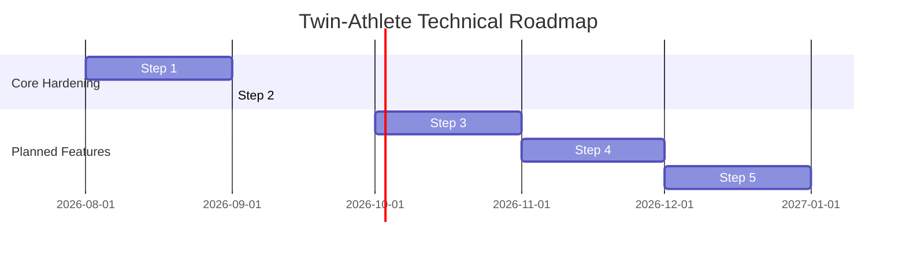

# Technology Stack & Architectural Strategy
## Twin-Athlete: Component Decisions, Boundaries & Deployment Blueprint
**Document Version:** `2.5.0`  
**Status:** Approved Technical Specification  

---

### 1. Current Technology Stack & Versions

| Layer | Component | Version | Role in Platform |
| :--- | :--- | :--- | :--- |
| **Runtime** | Python | `3.11.x` | Base language environment (strongly typed dataclasses, typing extensions) |
| **Web Server** | Flask | `≥3.0.0` | Lightweight WSGI micro-framework, REST API routing & SSE stream response |
| **WSGI Server** | Gunicorn | `≥21.2.0` | Production WSGI HTTP server with multi-worker support |
| **Real-Time Stream**| Server-Sent Events (SSE) | Native HTTP/1.1 | Unidirectional 1 Hz telemetry push to web clients |
| **Machine Learning**| scikit-learn | `≥1.3.0` | Dual ensemble Random Forest regressors for fatigue and recovery forecasting |
| **Math & Data** | NumPy & Pandas | `≥1.26.0`, `≥2.1.0` | Vectorized calculations, sliding-window deques, holdout validation splits |
| **Model Storage** | joblib | `≥1.3.0` | Optimized serialization and disk unpickling of trained model weights |
| **Database** | SQLite + WAL | `3.42+` (Built-in) | Zero-dependency local persistence for baselines, sessions, and ledger |
| **Frontend UI** | HTML5 / Vanilla CSS / JS | Native ES6+ | Zero-build, dependency-free cockpit UI with custom glassmorphic styling |
| **Edge Hardware** | Arduino C++ (ESP32) | `2.0.x core` | FreeRTOS dual-core I2C sensor sampling (MAX30102 + MPU6050) |
| **Containerization**| Docker | `Engine 24.x+` | Multi-stage lightweight `python:3.11-slim` container |

---

### 2. Architectural Rationale for Key Choices

#### 2.1 Flask Micro-Framework vs FastAPI / Django
* **Predictable Thread-Safe Lifecycle:** Telemetry ingestion requires simple, predictable synchronous thread management without asyncio event-loop conflicts when invoking NumPy or scikit-learn routines.
* **Low Dependency Surface:** Eliminates ORM overhead, migration churn, and complex ASGI connection pooling. Flask 3.0 supports native SSE streaming generators cleanly.
* **Zero Boilerplate:** The entire backend can boot and serve in under 1 second from cold start.

#### 2.2 Vanilla ES6+ HTML/CSS/JS vs React / Next.js
* **Zero Build Pipeline:** Eliminates Node.js runtime, `npm` package trees, webpack/vite bundlers, and hydration overhead. The cockpit runs immediately directly from Flask's static directory.
* **Predictable Real-Time Performance:** Direct DOM manipulation for 1 Hz telemetry updates avoids virtual DOM diffing penalties and memory leaks during multi-hour training monitoring sessions.
* **Longevity & Portability:** Standard HTML5/CSS/JS guarantees the cockpit interface remains functional 5+ years into the future without framework obsolescence.

#### 2.3 SQLite in WAL Mode vs PostgreSQL / Redis
* **Zero-Ops Self-Contained Vault:** Requires no external database daemon, network credentials, port configuration, or cloud hosting costs.
* **Write-Ahead Logging (WAL) Concurrency:** Enables simultaneous high-frequency telemetry logging and fast read queries without table locks or reader-writer contention.
* **Biometric Data Sovereignty:** Athlete health records remain isolated on the host machine, preventing unauthorized third-party access or accidental cloud exposure.

#### 2.4 Dual Random Forests + Mechanistic Fallback vs Deep Learning (LSTM / Transformers)
* **Tabular Sample Efficiency:** Longitudinal sports science datasets (~180 days) are ideally structured for ensemble tree models. Deep recurrent neural networks severely overfit on datasets of this scale.
* **Empirical Accuracy:** Random Forest achieves holdout $R^2 \ge 0.90$ with low residual error (MAE $\le 1.8$ points).
* **Guaranteed Reliability:** If system security policies block compiled C extensions (e.g., Windows AppLocker or restricted Linux kernels), the platform falls back to the deterministic Banister differential model without failing.

---

### 3. Explicit "Keep Simple" Decisions

1. **No External Message Broker (RabbitMQ / Kafka):** In-memory ring buffers and sliding deques ($N=60$) handle single-athlete and squad telemetry with sub-millisecond latency and zero infrastructure footprint.
2. **No Heavyweight Client State Libraries (Redux / Pinia):** State flows top-down via native Server-Sent Events (SSE) directly into DOM controllers.
3. **No Third-Party Analytics Trackers:** Zero advertising pixels, telemetry trackers, or external CDN dependencies. All CSS, JS, and typography assets are self-contained.

---

### 4. Planned Upgrades & Implementation Roadmap



* **Step 3 (Multi-Athlete Twin Registry):** Scale from single-athlete global state to an `AthleteRegistry` that routes incoming packets to individual `DigitalTwin` instances and computes squad-wide ACWR risk distributions.
* **Step 4 (Activity File Replay):** Ingest and replay historical Garmin/Polar/Wahoo CSV or FIT files through the live ingestion pipeline with adjustable playback speeds (1x, 2x, 5x).
* **Step 5 (Lightweight Session Auth & IoT API Keys):** Enforce `X-Sensor-Key` header authentication on physical ingestion endpoints to secure IoT hardware streams.

---

### 5. Deployment & Testing Strategy

#### Production Containerization
Twin-Athlete is packaged using a multi-stage Docker build with non-root security execution:
```dockerfile
FROM python:3.11-slim
WORKDIR /app
COPY requirements.txt .
RUN pip install --no-cache-dir -r requirements.txt
COPY . .
EXPOSE 5000
CMD ["gunicorn", "app:app", "--bind", "0.0.0.0:5000", "--workers", "2", "--timeout", "60"]
```

#### Forensic Verification Pipeline
Every commit is validated against the 40-test automated suite:
```bash
python -m unittest discover -p "test_*.py"
```

**Verification Layers:**
1. **Contract Layer:** Tests rejection of impossible sensor packets (HR > 240, SpO2 < 70%).
2. **Resilience Layer:** Tests dual-mode execution (ML inference vs mechanistic fallback).
3. **Persistence Layer:** Tests SQLite WAL mode, baseline updates, and feedback ledger matching.
4. **Physiological Layer:** Tests mathematical formulas (Banister TRIMP, ACWR, Keytel EE, gait asymmetry).
5. **Security Layer:** Tests rate limiting (35 req/s) and HTTP security headers (`nosniff`, `SAMEORIGIN`).
