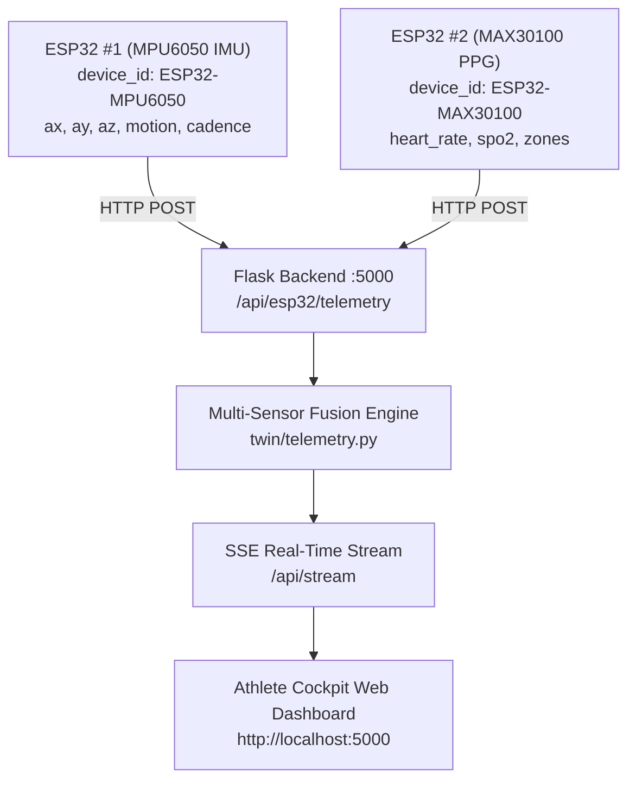

# ESP32 Athlete Tracker: Wiring & Setup Guide

This guide explains how to connect sensors to your ESP32 boards, flash the firmware sketches, and stream real-time biometrics and biomechanics to the **Digital Twin Athlete** cockpit.

The backend supports **Multi-Sensor Fusion**: you can use a single ESP32 with both sensors or two independent ESP32 boards streaming concurrently.

---

## Architecture: Dual ESP32 Configuration

Using two separate ESP32 microcontrollers gives you modular wearability (e.g., wrist-mounted MAX30100 PPG sensor and torso/foot-mounted MPU6050 IMU motion tracker).



---

## 1. Hardware Pinout & Wiring

### ESP32 #1 — MPU6050 (6-Axis IMU Accelerometer/Gyroscope)
- **Sketch:** `firmware/esp32_mpu6050/esp32_mpu6050.ino`
- **Device ID:** `ESP32-MPU6050`
- **I2C Address:** `0x68`

| ESP32 #1 Pin | MPU6050 Pin | Notes |
| :--- | :--- | :--- |
| **3.3V** | VCC | Use 3.3V (do **not** use 5V) |
| **GND** | GND | Common Ground |
| **GPIO 21** | SDA | I2C Data Line |
| **GPIO 22** | SCL | I2C Clock Line |

---

### ESP32 #2 — MAX30100 (Pulse Oximeter & Heart Rate)
- **Sketch:** `firmware/esp32_max30100/esp32_max30100.ino`
- **Device ID:** `ESP32-MAX30100`
- **I2C Address:** `0x57`

| ESP32 #2 Pin | MAX30100 Pin | Notes |
| :--- | :--- | :--- |
| **3.3V** | VIN / VCC | Connect to 3.3V rail |
| **GND** | GND | Common Ground |
| **GPIO 21** | SDA | I2C Data Line |
| **GPIO 22** | SCL | I2C Clock Line |

> [!NOTE]
> **No sensors attached yet?**
> You can flash both sketches immediately! Each firmware includes built-in fallback simulation so you can verify Wi-Fi communication and dashboard reception right away before soldering or wiring.

---

## 2. Flashing the ESP32s with Arduino IDE

### Step A: Configure ESP32 #1 (MPU6050)
1. In Arduino IDE, open `firmware/esp32_mpu6050/esp32_mpu6050.ino`.
2. Update your Wi-Fi credentials and PC server IP:
   ```cpp
   const char* WIFI_SSID     = "YOUR_WIFI_NAME";
   const char* WIFI_PASSWORD = "YOUR_WIFI_PASSWORD";
   const char* SERVER_URL    = "http://10.1.7.170:5000/api/esp32/telemetry";
   const char* DEVICE_ID     = "ESP32-MPU6050";
   ```
3. Connect ESP32 #1 via USB, select its COM port, and click **Upload**.

### Step B: Configure ESP32 #2 (MAX30100)
1. Open `firmware/esp32_max30100/esp32_max30100.ino`.
2. Update the Wi-Fi credentials and PC server IP:
   ```cpp
   const char* WIFI_SSID     = "YOUR_WIFI_NAME";
   const char* WIFI_PASSWORD = "YOUR_WIFI_PASSWORD";
   const char* SERVER_URL    = "http://10.1.7.170:5000/api/esp32/telemetry";
   const char* DEVICE_ID     = "ESP32-MAX30100";
   ```
3. Connect ESP32 #2 via USB, select its COM port, and click **Upload**.

---

## 3. Verifying the Connection

1. Open the web cockpit: [http://localhost:5000](http://localhost:5000)
2. Open the diagnostics endpoint: [http://localhost:5000/api/esp32/status](http://localhost:5000/api/esp32/status)
   - When both boards are streaming, `connected_count` will show `2` and `status` will read `"Streaming (2 ESP32s Online)"`.
3. The real-time SSE stream merges both feeds seamlessly into the athlete's digital twin model.
